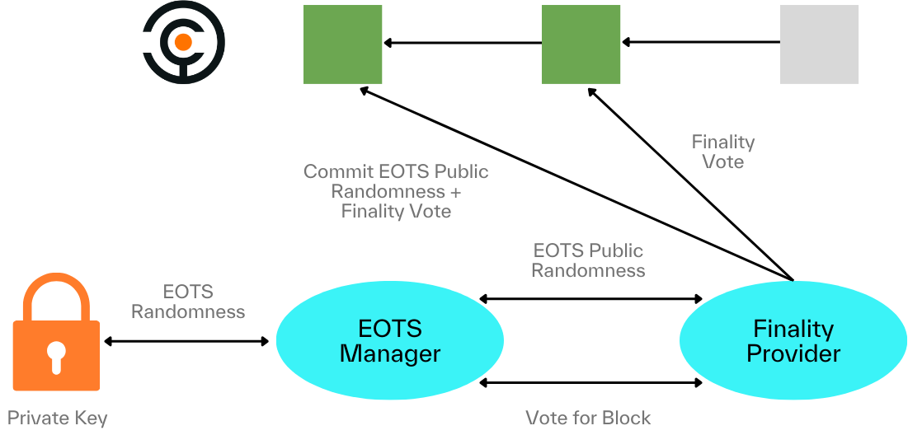

# BTC-Validator

A toolset crafted for the creation and
management of Finality Providers.

## 1. Overview

Finality providers are responsible for voting
at a finality round on top of Tendermint.
Similar to any native PoS validator,
a finality provider can receive voting power delegations from BTC stakers,and
can earn commission from the staking rewards denominated in Babylon tokens.

The finality provider toolset does not have
any special hardware requirements
and can operate on standard mid-sized machines
running a UNIX-flavored operating system.
It consists of the following programs:
- *Babylon full node*: An instance of a Babylon node connecting to
  the Babylon network. Running one is not a strict requirement,
  but it is recommended for security compared to trusting a third-party RPC node.
- *Extractable One-Time Signature (EOTS) manager*:
  A daemon responsible for securely maintaining the finality provider’s
  private key and producing extractable one time signatures from it.
- *Finality Provider*: A daemon managing the finality provider.
  It connects to the EOTS manager to generate EOTS public randomness and
  finality votes for Babylon blocks, which it submits to Babylon through
  the node connection.

The following graphic demonstrates the interconnections between the above programs:




## 2. Installation

#### Prerequisites

This project requires Go version 1.21 or later.

Install Go by following the instructions on
the [official Go installation guide](https://golang.org/doc/install).

#### Downloading the code

To get started, clone the repository to your local machine from Github:

```bash
$ git clone git@github.com:babylonchain/btc-validator.git
```

You can choose a specific version from
the [official releases page](https://github.com/babylonchain/btc-validator/releases)

```bash
$ cd finality-provider # cd into the project directory
$ git checkout <release-tag>
```

#### Building and installing the binary

```bash
# cd into the project directory
$ cd finality-provider

# installs the compiled binaries to your
# $GOPATH/bin directory allowing access
# from anywhere on your system
$ make install 
```

The above will produce the following binaries:

- `eotsd`: The daemon program for the EOTS manager.
- `find`: The daemon program for the finality-provider.
- `fincli`: The CLI tool for interacting with the finality-provider daemon.

To build locally,

```bash
$ cd finality-provider # cd into the project directory
$ make build
```

The above will lead to a build directory having the following structure:

```bash
$ ls build
    ├── eotsd
    ├── fincli
    └── find
```

## 3. Setting up a finality provider

#### 3.1. Setting up a Babylon Full Node

Before setting up the finality provider toolset,
an operator must ensure a working connection with a Babylon full node.
It is highly recommended that operators run their own node to avoid
trusting third parties. Instructions on how to set up a full Babylon node
can be found in 
[the Babylon documentation](https://docs.babylonchain.io/docs/user-guides/btc-timestamping-testnet/setup-node).

The finality provider requires a Babylon keyring with loaded funds to be attached to it
in order to be able to send transactions to Babylon.
To setup such a keyring, follow the instructions in
[the Babylon documentation](https://docs.babylonchain.io/docs/user-guides/btc-timestamping-testnet/getting-funds).

#### 3.2. Setting up the EOTS Manager

After a node and a keyring have been set up,
the operator can set up and run the
Extractable One Time Signature (EOTS) manager daemon.
A complete overview of the EOTS manager, its operation, and
its configuration options can be found in the
[EOTS Manager page](docs/eots.md)

#### 3.3. Setting up a Finality Provider 

The last step is to set up and run
the finality daemon.
A complete overview of the finality daemon, its operation, and
its configuration options can be found in the
[Finality page](docs/finality.md).

## 4. Delegations & Rewards

A finality provider receives BTC delegations through delegators
interacting with Babylon and choosing it as the recipient of their delegations.
To perform a self-delegation,
the operator can either visit the staking web app we provide,
or run the Babylon [BTC Staker program](https://github.com/babylonchain/btc-staker) once.
The BTC staker connects to a Bitcoin wallet and Babylon to perform delegations.
